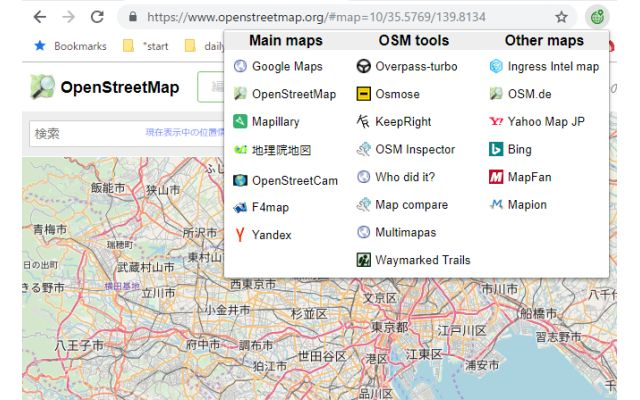
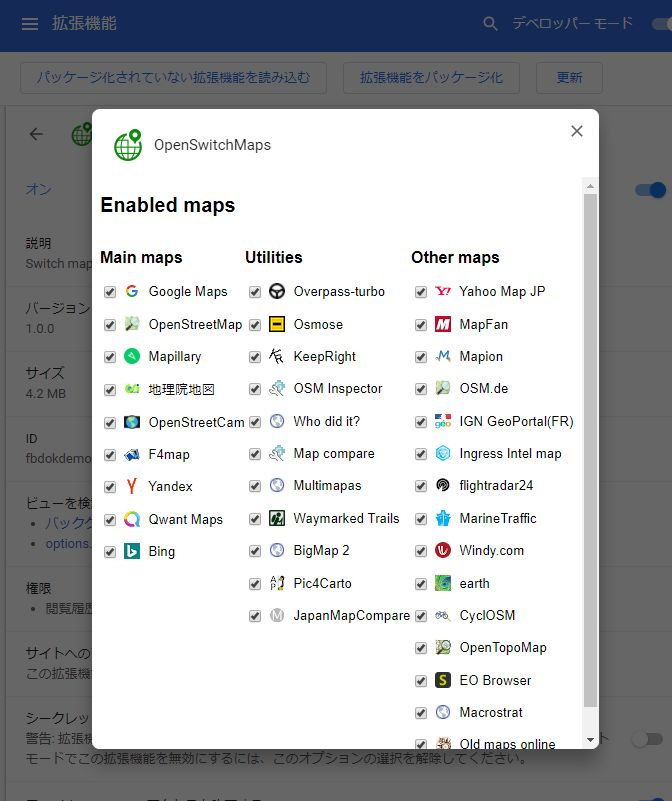
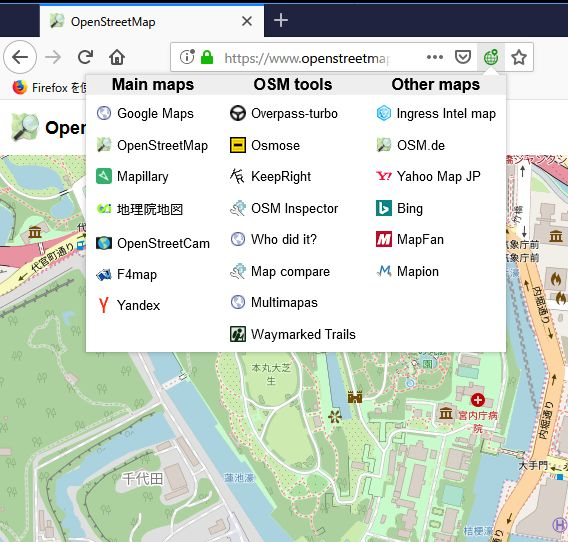

# OpenSwitchMaps
Map service switcher for Chrome/Firefox extension

Greatly contributed by jazzzz. Thanks!

## Install
### from Browser plugin
+ [Chrome webstore](https://chrome.google.com/webstore/detail/openswitchmaps/cfkddjlocfecchnemnnmmpdjcohgmkij)
+ [Firefox addon center](https://addons.mozilla.org/ja/firefox/addon/openswitchmaps/)
### from source code
This extention uses Node.js
1. Install Node.js
1. Install the dependencies: npm install
1. Build the extension: npm run build
1. The extension is built in the `dist` directory
1. Add to your Chrome/Firefox 

## How to use
1. Open Google map, for example
1. You will see a green earth icon near URL bar. Click it.
1. Select OpenStreetMap, for example
1. You can jump to OpenStreetMap at the same position
1. Left click: Open in the same tab. Middle click: Open a new tab.

## Settings
Show/hide maps:
1. Right click the earth icon,
1. Select "Options"
1. Check/uncheck each map to show/hide it.

## Screenshots
Chrome

Firefox

## Example video

## Similar softwares

* [OSM Smart Menu](https://github.com/jgpacker/osm-smart-menu), by jgpacker
* [MapJumper Plus](https://chrome.google.com/webstore/detail/mapjumper-plus/mdhfopoodheacfapdohpmjndgnfmdecj), by Tomas Kafka
* [Maps URL Converter](https://chrome.google.com/webstore/detail/maps-url-converter/ehnoijojkgigcmlimlndncbdfcmmlgmi), by lamphanviet.com
* [Mapswitch](https://chrome.google.com/webstore/detail/mapswitch/ineobcbceekmckhjifhdmglkhgngnhmd), by evgeny.ger
* [Map Switcher](https://chrome.google.com/webstore/detail/map-switcher/fanpjcbgdinjeknjikpfnldfpnnpkelb), by david.r.edgar
* [Map Helper](https://chrome.google.com/webstore/detail/map-helper/ihllleemlchjegcfnaglokgamafhafda), by petrovnn
* [MapSwitcher](https://addons.mozilla.org/ja/firefox/addon/map-switcher/), by František Nesveda

## Current (2020/06/05) supported map services
1. Baidu
1. Bing
1. F4map
1. Google Maps
1. Mapillary
1. OpenStreetCam
1. OpenStreetMap
1. Qwant Maps
1. Yandex
1. 地理院地図
1. BigMap 2
1. Distance calculator
1. JapanMapCompare
1. KeepRight
1. Kontur
1. Latest OSM Edits per Tile
1. Map compare
1. Multimapas
1. OpenStreetMap Analytics
1. OSM Inspector
1. Osmose
1. Overpass-turbo
1. Pic4Carto
1. Who did it?
1. earth
1. EO Browser
1. FIRMS
1. flickr
1. flightradar24
1. Gribrouillon
1. Ingress Intel map
1. Localwiki
1. Macrostrat
1. mapbox Cartogram
1. MarineTraffic
1. Old maps online
1. OpenAerialMap
1. OpenGeofiction
1. PeakFinder
1. Satellite Tracker 3D
1. STRAVA
1. Traze
1. Twitter
1. USGS earthquakes
1. Windy.com
1. 聖地巡礼マップ
1. Copernix
1. CyclOSM
1. Google Earth
1. here maps
1. Historic Place
1. maptiler
1. MAPY.CZ
1. Open Infrastructure Map
1. OpenCycleMap
1. OpenRailwayMap
1. openrouteservice
1. OpenSeaMap
1. OpenSnowMap
1. OpenStreetBrowser
1. OpenTopoMap
1. OpenTripMap
1. OSM Buildings
1. TomTom MyDrive
1. ViaMichelin
1. Waymarked Trails
1. waze
1. wikimapia
1. Wikimedia maps
1. World Imagery Wayback
1. yelp
1. Zoom Earth
1. 2gis(RU)
1. IGN Géoportail (FR)
1. MapFan (JP)
1. Mapion (JP)
1. Ordnance Survey(UK)
1. Yahoo Map (JP)
1. 今昔マップ(JP)
1. 地形図・地勢図図歴(JP)
1. 地質図Navi (JP)
1. 重ねるハザードマップ(JP)
1. OSM.ch
1. OSM.cl
1. OSM.de
1. OSM.in
1. OSM.jp
1. OSM.org.ar
1. OSM.ru
1. Apple maps (for Apple device)
1. Launch iD editor
1. Launch JOSM
1. Launch RapiD editor
1. Launch waze map editor
1. GeoHack
1. map.orhyginal

## Japanese descriptions
OpenStreetMapを中心に地図サービスを切り替えることができるChrome拡張機能です。
特にMapillary⇔OSM⇔Googleマップの切り替えが便利かと思います。

アイコンは [ICOOON MONO](http://icooon-mono.com/) から使用させていただきました。

説明用のスクリーンショット静止画にはOpenStreetMap((c)OpenStreetMap Contributors)を使用しています。

説明用のスクリーンキャプチャ動画には、OpenStreetMap(by OpenStreetMap Contributors), Mapillary(by Mapillary), F4map(by F4), KeepRight(by Harald Kleiner), Ingress Intel Map(by Niantic, Google)を使用しています。
