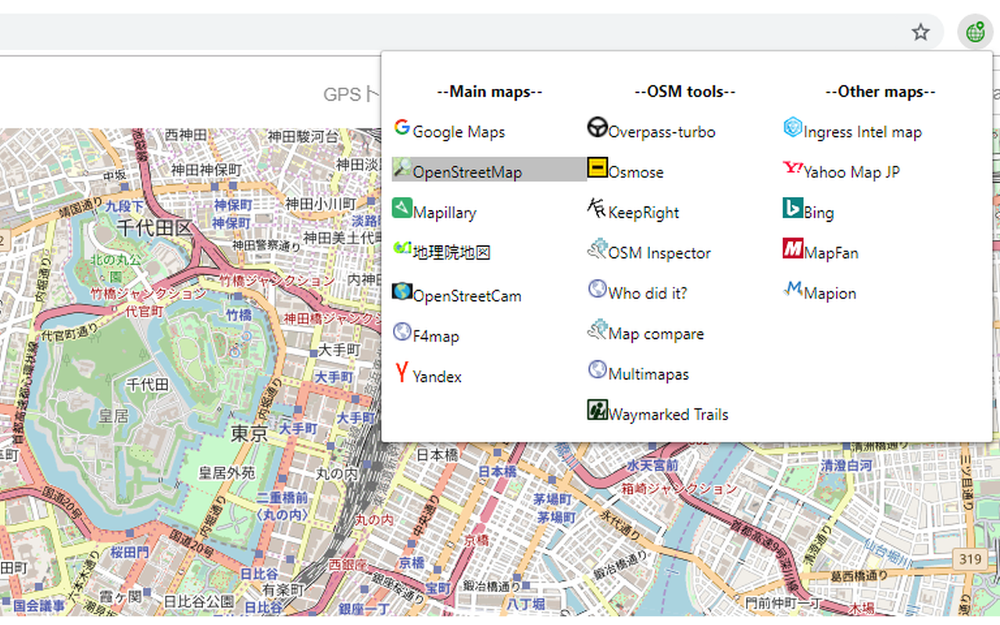

# OpenSwitchMap
Map service switcher for Chrome extension

OpenStreetMapを中心に地図サービスを切り替えることができるChrome拡張機能です。
特にMapillary⇔OSM⇔Googleマップの切り替えが便利かと思います。

アイコンはICOOON MONO(http://icooon-mono.com/)から使用させていただきました。

説明用のスクリーンショット静止画にはOpenStreetMap((c)OpenStreetMap Contributors)を使用しています。

説明用のスクリーンキャプチャ動画には、OpenStreetMap(by OpenStreetMap Contributors), Mapillary(by Mapillary), F4map(by F4), KeepRight(by Harald Kleiner), Ingress Intel Map(by Niantic, Google)を使用しています。
