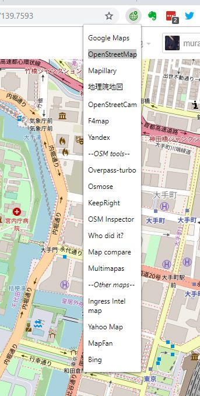

# OpenSwitchMap
Map service switcher for Chrome extension

OpenStreetMapを中心に地図サービスを切り替えることができるChrome拡張機能です。
特にMapillary⇔OSM⇔Googleマップの切り替えが便利かと思います。

アイコンはICOOON MONO(http://icooon-mono.com/)から使用させていただきました。
説明用のスクリーンショットにはOpenStreetMap((c)OpenStreetMap Contributors)を使用しています。
